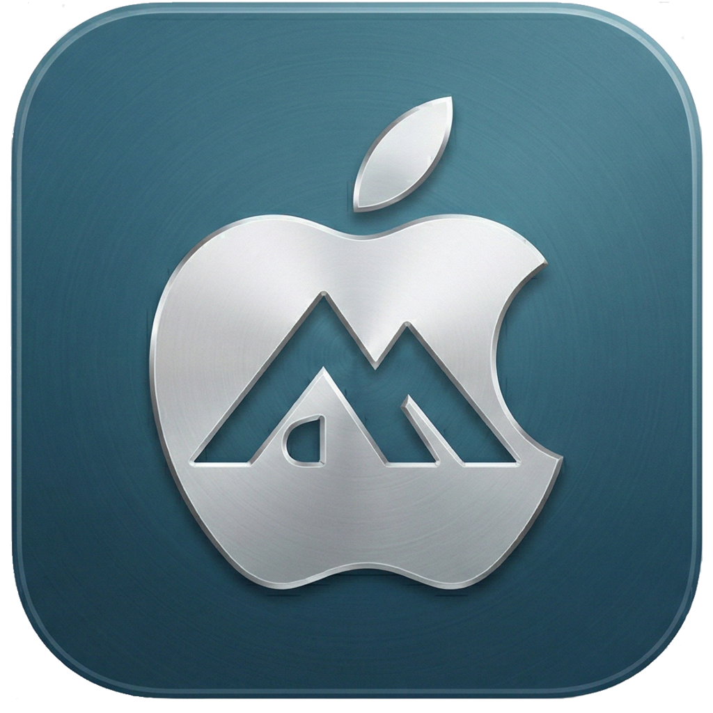

<p align="center">
  
</p>

<h1 align="center">Alpine on iOS</h1>

<p align="center">
  <a href="https://github.com/renaudallard/alpine_on_ios/releases/latest">
    
  </a>
  <a href="https://github.com/renaudallard/alpine_on_ios/actions/workflows/ci.yml">
    
  </a>
  <a href="https://github.com/renaudallard/alpine_on_ios/releases/latest">
    
  </a>
  
  
</p>

<p align="center">
  Run a full Alpine Linux aarch64 distribution on iPhone and iPad.<br>
  Near-native speed via JIT, with terminal and graphical display support.
</p>

---

## Features

- **Full Alpine Linux** with `apk` package manager
- **JIT execution** on aarch64 hosts for near-native speed
- **Terminal emulator** with VT100/xterm-256color, ANSI colors, UTF-8
- **Graphical display** via `/dev/fb0` framebuffer and Metal rendering
- **Touch input** mapped to Linux evdev mouse events
- **Thread support** with full `clone()` and `futex()`
- **100+ Linux syscalls** including epoll, eventfd, timerfd
- **Comprehensive SIMD/NEON** support (vector arithmetic, shifts, permute, compare, table lookup)
- **Virtual /proc and /dev** with stat support for proper filesystem traversal
- **Interactive shell** with line-mode I/O and fork/exec for external commands
- **DNS resolution** via /etc/resolv.conf created at first launch
- **X11 ready** with preconfigured xorg.conf for fbdev

## How It Works

Since iOS devices use ARM64 and Alpine Linux provides aarch64 packages,
the emulator runs guest code **natively** on the host CPU. Syscalls are
intercepted by patching `SVC` instructions with `BRK` traps at load
time and handling them via a `SIGTRAP` signal handler. This gives
near-native performance with no per-instruction overhead.

On non-aarch64 hosts, a full AArch64 instruction interpreter serves as
fallback.

```
+-----------------------+
|  Terminal | Display   |   SwiftUI tabs
+-----+-----+-----+----+
      |           |
+-----+-----+----+-----+
| VT100     | Metal     |   Terminal parser / MTKView 60fps
+-----+-----+-----+----+
            |
      +-----+-----+
      |  Bridge   |         Swift <-> C
      +-----+-----+
            |
      +-----+-----+
      |  AArch64  |         JIT native / interpreter fallback
      |  Engine   |
      +-----+-----+
            |
      +-----+-----+
      |  Syscall  |         100+ Linux syscalls emulated
      |  Layer    |
      +-----+-----+
            |
      +-----+-----+
      |  VFS      |         rootfs + /proc + /dev + /dev/fb0
      +-----------+
```

## Installing

Download the latest `.ipa` from
[**Releases**](https://github.com/renaudallard/alpine_on_ios/releases/latest)
and sideload it.

| Method | Cost | Re-sign | Notes |
|--------|------|---------|-------|
| [AltStore](https://altstore.io/) | Free | Every 7 days | Recommended. Wi-Fi install via AltServer |
| [Sideloadly](https://sideloadly.io/) | Free | Every 7 days | USB or Wi-Fi, drag and drop |
| [TrollStore](https://ios.cfw.guide/installing-trollstore/) | Free | Never | Permanent install, limited iOS versions |
| [Apple Developer](https://developer.apple.com/programs/) | $99/year | Yearly | No app limit, Xcode install |

After installing, trust the developer profile in
**Settings > General > Device Management**.

### First launch

1. Open **Alpine Terminal** from your home screen
2. The app extracts the Alpine rootfs on first launch (a few seconds)
3. You get an interactive shell
4. Install packages with `apk`:

```
apk update
apk add curl git python3 vim
```

### Graphical mode (X11)

```
apk add xorg-server xf86-video-fbdev xterm openbox
startx_fb   # helper defined in .profile
```

Switch to the **Display** tab to see the graphical output. Touch
the display for mouse input.

### Firefox

```sh
sh /root/start-firefox.sh
```

This installs X11, openbox, Firefox and fonts, then launches Firefox
on the framebuffer display.

## Building from Source

### Prerequisites

- **iOS**: macOS + Xcode 15+ + [XcodeGen](https://github.com/yonaskolb/XcodeGen)
- **Linux testing**: GCC or Clang (C11), make, pthreads

### Quick start

```sh
./rootfs/download_rootfs.sh          # download Alpine 3.21 aarch64
make                                  # build libemu.a
make test                             # 42 unit tests

# iOS build
xcodegen generate
xcodebuild build -project AlpineOnIOS.xcodeproj \
    -scheme AlpineOnIOS -sdk iphoneos \
    -configuration Release CODE_SIGNING_ALLOWED=NO

# package .ipa
./scripts/package_ipa.sh build/Build/Products/Release-iphoneos
```

### CI and releases

| Workflow | Trigger | Action |
|----------|---------|--------|
| `ci.yml` | Push / PR | Test on Linux, build iOS, upload artifact |
| `version-tag.yml` | `MARKETING_VERSION` change | Auto-create `v*` tag |
| `release.yml` | `v*` tag | Build .ipa, publish GitHub Release |

Bump `MARKETING_VERSION` in `project.yml` and push to release.

## Project Structure

```
alpine_on_ios/
  AlpineOnIOS/
    App/            SwiftUI entry point, ContentView, assets
    Terminal/       VT100 terminal emulator (view, buffer, parser, colors)
    Display/        Metal framebuffer display + touch input mapping
    Settings/       Font size, display resolution preferences
    Bridge/         Swift-to-C bridge, bridging header
  emu/
    include/        C headers (cpu, jit, memory, process, vfs, syscall, ...)
    src/            C implementation + jit_entry.S assembly
    tests/          Unit tests (42 tests)
  rootfs/
    download_rootfs.sh   Download Alpine minirootfs
    overlay/             X11 config, .profile, start-firefox.sh, resolv.conf
  scripts/               build_rootfs.sh, package_ipa.sh
  project.yml            XcodeGen spec
  .github/workflows/     CI, release, auto-tag
```

## Troubleshooting

| Problem | Solution |
|---------|----------|
| "Untrusted Developer" | Settings > General > Device Management > Trust |
| App crashes on launch | Requires iOS 15.0 or later |
| AltStore can't find server | Ensure AltServer is running, same Wi-Fi |
| App expires after 7 days | Re-sign with AltStore/Sideloadly, or use TrollStore |
| No keyboard input | Tap the terminal area to focus the keyboard |
| Blank terminal | Delete and reinstall the app to re-extract rootfs |

## Support

If you find this project useful, consider supporting its development:

[](https://www.paypal.me/RenaudAllard)

## License

ISC License. See source files for the full text.

```
Copyright (c) 2026 Alpine on iOS contributors
```
