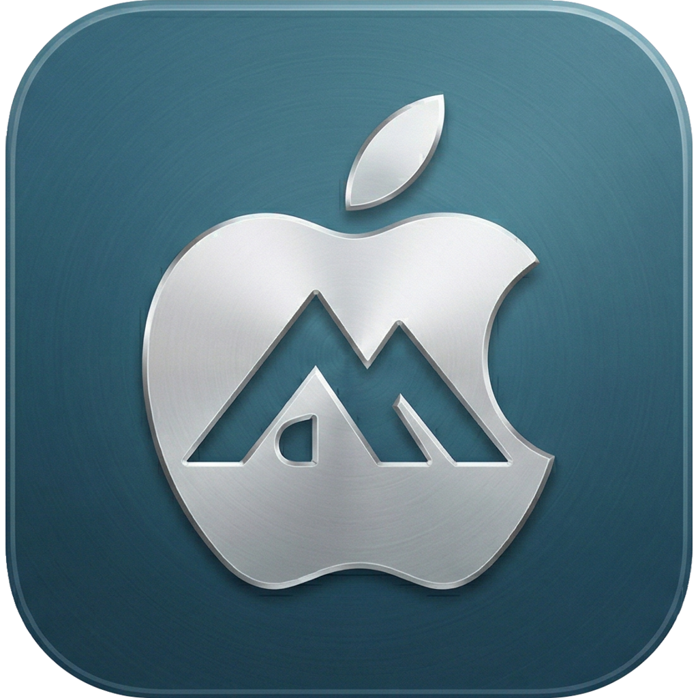

<p align="center">
  
</p>

<h1 align="center">Alpine on iOS</h1>

<p align="center">
  <a href="https://github.com/renaudallard/alpine_on_ios/releases/latest">
    
  </a>
  <a href="https://github.com/renaudallard/alpine_on_ios/actions/workflows/ci.yml">
    
  </a>
  <a href="https://github.com/renaudallard/alpine_on_ios/releases/latest">
    
  </a>
  
  
</p>

<p align="center">
  Run a full Alpine Linux aarch64 distribution on iPhone and iPad.<br>
  Near-native speed via AOT precompilation. No developer account needed.
</p>

---

## Features

- **Full Alpine Linux** with `apk` package manager and AOT package repository
- **Native execution** on iOS via Mach-O conversion (no interpreter, no runtime JIT)
- **Terminal emulator** with VT100/xterm-256color, ANSI colors, line editing, history
- **Graphical display** via `/dev/fb0` framebuffer and Metal rendering at 60fps
- **Touch input** mapped to Linux evdev mouse events
- **Thread support** with full `clone()` and `futex()`
- **100+ Linux syscalls** including epoll, eventfd, timerfd, copy_file_range
- **Networking** with DNS resolution (musl getaddrinfo) and HTTP (wget, curl)
- **Virtual /proc and /dev** with stat, framebuffer, and evdev input devices
- **Interactive shell** with Ctrl+C/Ctrl+Z signal support
- **X11 ready** with preconfigured xorg.conf for fbdev, MATE/openbox/Firefox

## How It Works

Since iOS devices use ARM64 and Alpine Linux provides aarch64 packages,
guest code runs **natively** on the host CPU. At build time, each ELF
binary is processed in two stages:

1. **AOT patch**: `SVC #0` (Linux syscall) instructions are replaced
   with `BRK #1` traps.
2. **Mach-O conversion**: the patched ELF is wrapped into a Mach-O
   dynamic library (`.dylib`) with the same code+data layout. The
   dylib is codesigned as part of the app bundle.

At runtime, `dlopen()` loads the dylib. iOS trusts it because it is
signed Mach-O in the app bundle. A `SIGTRAP` handler intercepts the
`BRK` traps and dispatches to emulated Linux syscalls. This gives
near-native performance with no per-instruction overhead and no
runtime JIT.

```
+-----------------------+
|  Terminal | Display   |   SwiftUI tabs
+-----+-----+-----+----+
      |           |
+-----+-----+----+-----+
| VT100     | Metal     |   Terminal parser / MTKView 60fps
+-----+-----+-----+----+
            |
      +-----+-----+
      |  Bridge   |         Swift <-> C
      +-----+-----+
            |
      +-----+-----+
      | AOT native |        dlopen signed Mach-O + SIGTRAP handler
      +-----+-----+
            |
      +-----+-----+
      |  Syscall  |         100+ Linux syscalls emulated
      |  Layer    |
      +-----+-----+
            |
      +-----+-----+
      |  VFS      |         bundle rootfs + overlay + /proc + /dev
      +-----------+
```

## Installing

### iOS

Download the latest `.ipa` from
[**Releases**](https://github.com/renaudallard/alpine_on_ios/releases/latest)
and sideload it.

| Method | Cost | Re-sign | Notes |
|--------|------|---------|-------|
| [AltStore](https://altstore.io/) | Free | Every 7 days | Recommended. Wi-Fi install via AltServer |
| [Sideloadly](https://sideloadly.io/) | Free | Every 7 days | USB or Wi-Fi, drag and drop |
| [TrollStore](https://ios.cfw.guide/installing-trollstore/) | Free | Never | Permanent install, limited iOS versions |
| [Apple Developer](https://developer.apple.com/programs/) | $99/year | Yearly | No app limit, Xcode install |

After installing, trust the developer profile in
**Settings > General > Device Management**.

### First launch

1. Open **Alpine Terminal**
2. The app sets up symlinks and configuration on first launch
3. You get an interactive shell with line editing and history

### Installing packages

```
apk update --allow-untrusted
apk add curl git python3 vim
```

### Graphical mode (X11)

```
apk add --allow-untrusted xorg-server xf86-video-fbdev xterm openbox
startx
```

Switch to the **Display** tab to see the graphical output.

### Firefox

```sh
apk add --allow-untrusted firefox-esr font-noto openbox dbus
sh ~/start-firefox.sh
```

## Building from Source

### Prerequisites

- **iOS**: macOS + Xcode 15+ + [XcodeGen](https://github.com/yonaskolb/XcodeGen)
- **Linux testing**: GCC or Clang (C11), make, pthreads

### Quick start

```sh
./rootfs/download_rootfs.sh          # download Alpine 3.21 aarch64
cd emu && make && make test && cd ..  # build and run 42 unit tests

# iOS build
xcodegen generate
xcodebuild build -project AlpineOnIOS.xcodeproj \
    -scheme AlpineOnIOS -sdk iphoneos \
    -configuration Release CODE_SIGNING_ALLOWED=NO

# package .ipa
./scripts/package_ipa.sh build/Build/Products/Release-iphoneos
```

The Xcode post-build script copies the rootfs into the app bundle,
AOT-patches all ELF binaries, and ad-hoc codesigns them.

### CI and releases

| Workflow | Trigger | Action |
|----------|---------|--------|
| `ci.yml` | Push / PR | Linux unit tests, iOS build, native + Simulator integration tests |
| `version-tag.yml` | `MARKETING_VERSION` change | Auto-create `v*` tag, dispatch release |
| `release.yml` | Tag / dispatch | Build IPA + DMG, publish GitHub Release |
| `aot-repo.yml` | Daily / manual | Build AOT-patched APK repository |

Bump `MARKETING_VERSION` in `project.yml` and push to release.

## Project Structure

```
alpine_on_ios/
  AlpineOnIOS/
    App/            SwiftUI entry point, ContentView, rootfs setup
    Terminal/       VT100 terminal emulator (view, buffer, parser, colors)
    Display/        Metal framebuffer display + touch input mapping
    Settings/       Font size preferences
    Bridge/         Swift-to-C bridge, bridging header
  emu/
    include/        C headers (cpu, native, memory, process, vfs, syscall, ...)
    src/            C implementation + native_entry.S assembly
    tests/          Unit + integration tests (42 unit, 2 integration)
  rootfs/
    download_rootfs.sh   Download Alpine minirootfs
    overlay/             X11 config, .profile, start-firefox.sh
  scripts/
    aot_patch.py         AOT patcher: SVC->BRK in ELF binaries
    elf2macho.c          ELF -> Mach-O dylib converter (16K page, dyld binds)
    patch_rootfs_aot.sh  Patch + codesign all ELFs in a rootfs
    build_aot_repo.sh    Build AOT-patched APK repository
    build_rootfs.sh      Rootfs assembly
    package_ipa.sh       IPA packaging
  project.yml            XcodeGen spec (iOS target)
  .github/workflows/     CI, release, auto-tag, AOT repo
```

## Troubleshooting

| Problem | Solution |
|---------|----------|
| "Untrusted Developer" | Settings > General > Device Management > Trust |
| App crashes on launch | Requires iOS 15.0 or later |
| AltStore can't find server | Ensure AltServer is running, same Wi-Fi |
| App expires after 7 days | Re-sign with AltStore/Sideloadly, or use TrollStore |
| No keyboard input | Tap the terminal area to focus the keyboard |
| Blank terminal | Wait for the "Spawning shell..." indicator to finish |
| apk signature errors | Use `--allow-untrusted` for the AOT repository |

## Support

If you find this project useful, consider supporting its development:

[](https://www.paypal.me/RenaudAllard)

## License

ISC License. See source files for the full text.

```
Copyright (c) 2026 Alpine on iOS contributors
```
